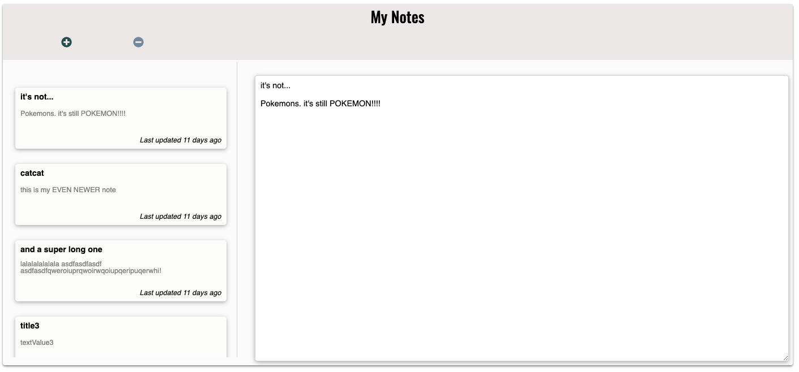

A simple CRUD note-taking app using Create-React-App

<p align="center">
  
</p>

### For Users:
1. Install dependencies
```
yarn
```
2. Create database in Postgres
```
psql
```
```
CREATE DATABASE notes_app;
```
3. Create `.env` file in root directory and assign Postgres username to variable
```
DB_user=yourUsername
```
4. Update seed data in `/models/seeds/data` if desired

5. Run migrations and seed commands
```
yarn migrate
```
```
yarn seed
```
6. Start backend and frontend servers in separate terminals
```
yarn start
```
```
yarn dev
```
7. Open frontend server at [http://localhost:3000/](http://localhost:3000/).

### Technologies Used:
- React
- Express
- Knex
- Postgres
